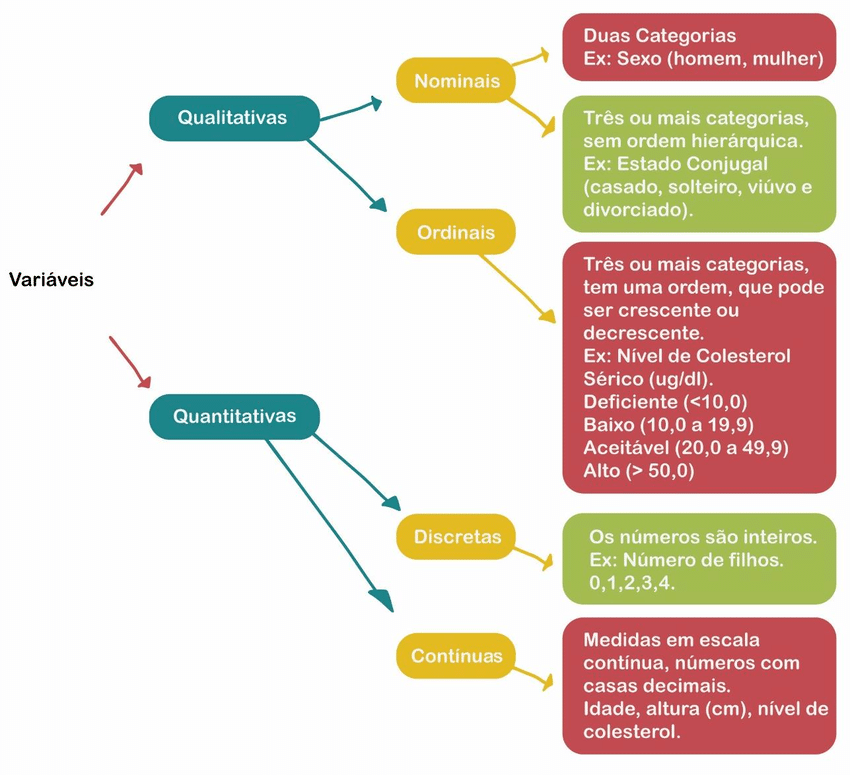
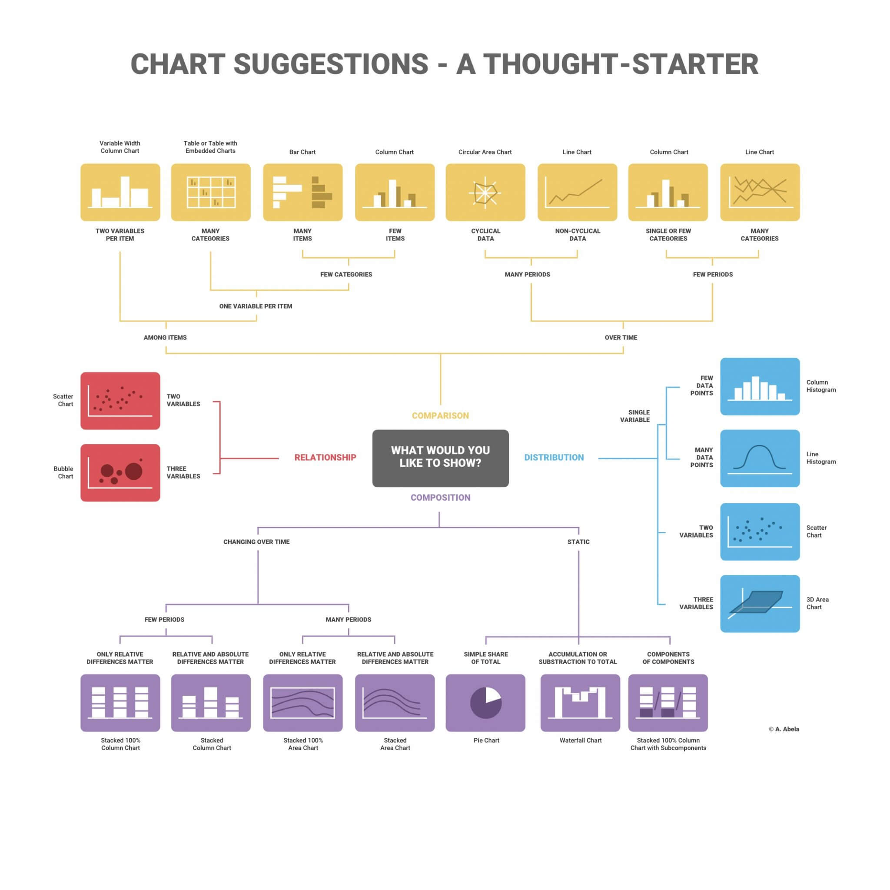

<h1 align="center">
  
</h1>

# Visualização de dados

Turma Online On33 | Python | Semana 16 | 2024 | <a href="https://www.linkedin.com/in/mariana-vb-rezende/" target="_blank" rel="noopener noreferrer">Professora Mariana Rezende</a>

### Instruções
Antes de começar, vamos organizar nosso setup.
* Fork esse repositório 
* Clone o fork na sua máquina (Para isso basta abrir o seu terminal e digitar `git clone url-do-seu-repositorio-forkado`)
* Entre na pasta do seu repositório (Para isso basta abrir o seu terminal e digitar `cd nome-do-seu-repositorio-forkado`)
* [Add outras intrucoes caso necessario]

### Resumo
O que veremos na aula de hoje?
* [Introdução ao Tableau Public](#tema1)
* [Dashboards: Uma Nova Era na Visualização de Dados](#tema2)
* [Construíndo visualizações no Tableau Public](#tema2)
* [Refatorando visualizações criadas com os dados da Olist](#tema2)
* [Desafio da Semana ](#tema2)

## Conteúdo
### Introdução ao Tableau Public  
1. [Atividade: Criando sua conta no Tableau](#atividade-criando-sua-conta-no-tableau)

### Dashboards: uma nova era na visualização de dados
1. [Por que criar uma visualização de dados?](#por-que-criar-uma-visualização-de-dados)
2. [Como viemos parar aqui?](#como-viemos-parar-aqui)
3. [Princípios básicos da visualização de dados](#princípios-básicos-da-visualização-de-dados)
4. [Etapas da criação de uma visualização de dados](#etapas-da-criação-de-uma-visualização-de-dados)    
    * [Como definir que tipo de gráfico usar?](#como-definir-que-tipo-de-gráfico-usar)
    * [Atividade: Avaliando os tipos de dados na base da Netflix e Olist](#atividade-avaliando-os-tipos-de-dados-na-base-da-netflix-e-olist)
    
2.  [Etapas da criação de uma visualização de dados (continuação)](#etapas-da-criação-de-uma-visualização-de-dados)
    * [Storytelling](#storytelling)
    * [Design](#design)
    * [Atividade: Avaliando dashboards e sua eficácia](#tema2)
   
### Criando dashboards no Tableau Public
* [Importando dados](#tema2)
* [Criando Gráficos](#tema2)
* [Criando Dashboards](#tema2)

'

---
### Introdução ao Tableau Public 
*o github da visualização de dados*

O Tableau Public é uma plataforma gratuita para explorar, criar e compartilhar publicamente visualizações de dados online. Através dele é possível publicar suas visualizações em uma espécie de "repositório", então é uma excelente alternativa para a criação de um portfólio de dados. No próprio site da empresa você consegue acessar os repositórios de outras pessoas e explorar seus projetos. A empresa Tableau possui vários produtos, contudo, o Tableau Public é um software gratuito que pode ser utilizado tanto no desktop quanto na nuvem.

#### Atividade: Criando sua conta no Tableau
  Agora é hora de vocês conhecerem um pouquinho mais sobre essa ferramenta!

  Com milhões de visualizações de dados interativas feitas por mais de um milhão de criadores em todo o mundo, o Tableau Public permite que você explore a arte do que é possível com dados sobre qualquer assunto, de música a esportes e política. **Navegue nos canais selecionados de visualizações criadas pela comunidade ou pesquise tópicos por palavra-chave com a ajuda de hashtags**. 
  

  Para essa dinâmica, vocês irão:

  1. Criar a sua [conta](https://id.tableau.com/register?clientId=wcS7HwY98qdfgBREHT7Xoln7ipc75U0a);
  2. Logar no [Tableau Public](https://identity.idp.tableau.com/login?state=hKFo2SBXUUc4cmxFek5Ya3JyRDlFMFB3cEppMW5iWnpfZmdDWKFupWxvZ2luo3RpZNkgVm0yNEw1bGgxQUo2U1FCYnJBWVk0c0VuUmRfdGZON3CjY2lk2SB3Y1M3SHdZOThxZGZnQlJFSFQ3WG9sbjdpcGM3NVUwYQ&client=wcS7HwY98qdfgBREHT7Xoln7ipc75U0a&protocol=oauth2&response_type=code&redirect_uri=https%3A%2F%2Fpublic.tableau.com%2Fpublic%2Fapis%2Fauth%2Fprovision&scope=openid%20email%20profile&nonce=a5QRsMinkvo);
  3. Explorar os repositórios por temas que te interessem e ver como as pessoas dispõem e mostram essas informações. Caso goste de algum, favorite esse repositório! [Aqui](https://public.tableau.com/app/search/all)

 Divirta-se! :)

  > 🌟 **DICA**
  > As visualizações no Tableau Public podem ser baixadas ou exploradas em qualquer navegador. Veja rapidamente como uma visualização foi criada e crie uma versão própria. 
  
  > 🌟 **DICA** Adicione as visualizações que o inspiram ao seu canal Favoritos para criar uma coleção de visualizações que você pode revisitar a qualquer momento.

  
### Dashboards: Uma Nova Era na Visualização de Dados

#### Por que criar uma visualização de dados?
Na aula anterior, aprendemos sobre os fundamentos da análise de dados, criamos um notebook exploratório com dados da Netflix e da Olist, e criamos visualizações utilizando o Python. Considerando que temos essa ferramenta que pode ser utilizada para trazer insights, qual o valor do Tableau aqui? Quais as vantagens de utilizar um dashboard em relação ao notebook?

Para responder essa pergunta, precisamos retomar um conceito aprendido na aula anterior: **empresas data-driven**. De forma simplista, uma empresa data-driven é uma empresa que toma decisões baseadas em dados. Portanto, os times que efetivamente tomam essas decisões não são técnicos, são pessoas de área comercial, negócios, operações que não necessariamente possuem qualquer conhecimento técnico. Portanto, se passamos um notebook exploratório para essas pessoas, poucos ou até nenhum insight e tomada de decisão será tomada a partir disso, porque? Porque a informação contida lá não está "digerida". É exatamente por esse motivo que ferramentas de dashboard são essenciais para apoiar os times de negócios. Com um dashboard, você é capaz de simplicar a informação e criar correlações que ajudem o time de negócios a entender padrões e tendências. Hoje, existem diversas ferramentas que fazem esse papel de dashboards, temos o próprio Tableau, Power BI, Looker, etc. Cada uma tem a sua especificidade, mas a ideia por trás é sempre a mesma, democratizar a informação de forma simples e eficaz.

#### Como viemos parar aqui?

As primeiras visualizações de informação remontam aos mapas de navegação elaborados por exploradores e navegadores antigos, , especialmente a partir da Era dos Descobrimentos nos séculos XV e XVI. Estes mapas não apenas delineavam rotas marítimas e geografia, mas também eram essenciais para a compreensão e comunicação das descobertas e conquistas territoriais. Ao representar graficamente as rotas navegáveis, perigos marítimos e pontos de interesse, esses mapas não só facilitaram a navegação, mas também estabeleceram um precedente na arte de visualizar dados complexos de maneira intuitiva e compreensível.

Ao longo da história da visualização de dados, figuras como Florence Nightingale foram pioneiras na criação de representações que transcendem o simples relato numérico. Florence, conhecida não apenas por suas contribuições na enfermagem, mas também na estatística, criou um diagrama que se tornou icônico: a rosa de Nightingale. Este diagrama, desenvolvido durante a Guerra da Crimeia, ilustrou de forma vívida e acessível a magnitude das mortes por doenças evitáveis nos hospitais militares britânicos. A notoriedade do diagrama não se limita à sua eficácia técnica, mas também à habilidade de Nightingale em comunicar visualmente uma mensagem complexa de maneira impactante e memorável para o público da época.

[Infográficos: uma linha do tempo](https://history.infowetrust.com/)

[A história de Florance Nightingale](https://www.youtube.com/watch?v=Ik6X2-DCudU)

Com o advento da era digital e a disseminação de computadores pessoais, surgiram uma infinidade de softwares especializados, (como o Tableau), que democratizaram e facilitaram a criação de visualizações complexas. Essas ferramentas proporcionam interfaces intuitivas e recursos de arrastar e soltar, permitindo que mais pessoas possam criar visualizações dinâmicas e informativas. Esse avanço não apenas simplificou o processo de análise de dados, mas também ampliou o alcance e a eficácia das interpretações derivadas dos dados, transformando a maneira como empresas e profissionais abordam a visualização e a utilização de dados para decisões estratégicas.

> 🌟 **DICA**
> Esta é uma coleção de algumas das muitas ferramentas, aplicativos, kits de ferramentas, bibliotecas, plataformas e pacotes de visualização de dados (e relacionados). Organizada desde de 2010 para fornecer aos leitores uma visão atual e abrangente do cenário da tecnologia de visualização de dados. 
[link](https://visualisingdata.com/resources/)

#### Princípios básicos da visualização de dados
Nesta seção, vamos explorar os princípios fundamentais que norteiam a criação de visualizações eficazes e impactantes. Vamos mergulhar em conceitos-chave que ajudarão você a criar visualizações que comunicam informações de forma clara e concisa.

O que é a visualização de dados? É a representação gráfica ou visual de informações, padrões ou insights contidos em conjuntos de dados. Essa representação gráfica e visual pode ser feita através de gráficos, tabelas, mapas, infográficos e outros elementos visuais para traduzir dados numéricos e estatísticos em formas mais compreensíveis. Traduzindo essa informação, facilitamos a interpretação e a análise dos dados, tornando as informações mais acessíveis, claras e impactantes. Quando bem projetadas, as visualizações podem permitir a identificação de tendências, padrões, correlações e anomalias, auxiliando na tomada de decisões informadas, na comunicação eficaz de insights e no suporte à resolução de problemas complexos.

Independentemente do campo de atuação, a capacidade de visualizar dados é uma habilidade valiosa para profissionais em diversos setores. Por exemplo:

* Negócios e Gestão: Utilizada em análises de negócios, gestão de projetos, inteligência de negócios para auxiliar na monitorização de métricas de desempenho, avaliação de resultados e planejamento estratégico.

* Ciência e Pesquisa: Em pesquisa científica, a visualização de dados é usada para representar resultados de estudos, modelagem de dados e padrões complexos, bem como para divulgar descobertas para o público em geral, como por exemplo em artigos científicos.

* Jornalismo e Mídia: Podem ser utilizadas por jornalistas para contar histórias e apresentar informações complexas de forma acessível ao público, especialmente em temas como política, economia, saúde e questões sociais.

* Saúde e Medicina: Em saúde, é usada para rastrear epidemias, analisar dados de pacientes e melhorar a compreensão de padrões e tendências em dados médicos.

* Marketing e Vendas: A visualização de dados ajuda as empresas a entender o comportamento do cliente, analisar o desempenho das campanhas de marketing e tomar decisões estratégicas de vendas.

#### Etapas da criação de uma visualização de dados
Assim como fizemos durante a nossa análise exploratória na aula passada, com a visualização de dados que iremos criar, precisamos garantir que as perguntas feitas inicialmente serão respondidas.

1. Definição dos objetivos: Assim como fizemos durante a nossa análise exploratória na aula passada, com a visualização de dados que iremos criar, precisamos garantir que as perguntas feitas inicialmente serão respondidas.

2. Escolhendo gráficos adequados: Para garantir que as nossas perguntas sejam corretamente respondidas, é importante entender os diferentes tipos de gráficos que temos e qual deles seria o mais adequado, afinal, temos diferentes tipos de gráficos e suas capacidades para representar diferentes tipos de dados (quantitativos, qualitativos, temporais, espaciais etc).

3. Organização e sequência lógica: Organização da visualização em uma sequência lógica que faça sentido e que ajudem à contar uma história que guie os usuários.

4. Escolha da paleta de cores: A escolha das cores em si não faz diferença no quão bem as suas visualizações serão absorvidas, o ponto aqui é se manter em uma paleta de cores para todas as visualizações. A mudança brusca de paletas com contrastes diferentes pode tirar a atenção do usuário para o que realmente importa: os dados. Cores devem ser utilizadas de forma estratégica para enfatizar padrões e dar agilidade na interpretação da informação.

Agora, vamos entender um pouco melhor sobre como podemos trabalhar os diferentes tipos de dados para garantirmos que a informação será transmitida de forma clara. Como disse anteriormente, dependendo da natureza dos dados, diferentes tipos de gráficos são mais adequados para representá-los.

##### Como definir que tipo de gráfico usar?
A escolha do tipo de gráfico para representar nossas informações depende da natureza dos dados que estamos analisando. Para isso, é fundamental entendermos o conceito de classificação de variáveis. Esse conceito estatístico é crucial, pois é a estrutura que todos os softwares de análise, incluindo o Tableau, utilizam para organizar seu ambiente de visualização e análise.

Uma classificação de variáveis segue a seguinte estrutura:

Da mesma forma, o Tableau identifica cada campo de um dataset como uma **dimensão** ou **medida** no painel Dados, dependendo do tipo de dados que o campo contém. E são essas campos que você usa esses para criar sua análise.

Os campos de dados são feitos de colunas na sua fonte de dados. Cada campo recebe automaticamente um tipo de dados, como número inteiro, cadeia de caracteres ou data, e uma função: uma dimensão discreta ou medida contínua (ou menos comumente, uma dimensão contínua ou medida discreta).

* **Dimensões contêm valores qualitativos** (como nomes, datas ou dados geográficos). Você pode usar as dimensões para categorizar, segmentar e revelar os detalhes nos seus dados. As dimensões afetam o nível de detalhe na exibição.

* **Medidas contém valores numéricos e quantitativos** que podem ser medidos. As medidas são agregadas por padrão (Soma, Média, Contagem,...). Quando você arrasta uma medida para a exibição, o Tableau aplica uma agregação na “pílula”.

##### Tableau: Campos azuis x verdes
O Tableau representa os dados de forma diferente na exibição, dependendo se o campo é discreto ou contínuo.

* Contínuo significa “formar um todo ininterrupto, sem interrupção”. Esses campos são coloridos em verde. Quando um campo contínuo é colocado na divisória Linhas ou Colunas, um eixo é criado na visualização.

* Discreto significa “individualmente separado ou distinto”. Esses campos são coloridos em azul. Quando um campo discreto é colocado na divisória Linhas ou Colunas, um cabeçalho é criado na visualização.

  [saiba mais](https://help.tableau.com/current/pro/desktop/pt-br/datafields_typesandroles.htm)

Entender bem a natureza dos nossos dados, nos ajuda a identificar quais tipos de gráficos poderão ser utilizados para melhor representá-los. No entanto, ainda assim a escolha de quais recursos visuais e gráficos usar dependem extremamente do seu CONTEXTO e OBJETIVO.

O diagrama abaixo pode ajudar você a escolher um gráfico para apresentar seus dados a partir do que você gostaria de mostrar: relações, comparações, distribuição, etc.

No entanto, lembre-se que, porque essas escolhas são sempre muito relativas esse é um tipo de conhecimento vem com a experiência, então... EXPERIMENTE!

Use as ferramentas e softwares a seu favor para testar várias possibilidades e variações para os mesmos dados.

Um bom catálogo de gráficos também pode te ajudar! Aqui seguem alguns links:

- https://www.anychart.com/chartopedia/usage-type/
- https://datavizcatalogue.com/

Sempre que estiver em dúvida sobre qual gráfico seria melhor. A resposta é simples: Qualquer um que seja fácil para seu público ler e compreender.

---
#### **Atividade: Avaliando os tipos de dados na base da Netflix e Olist**

Agora que vocês entenderam um pouco melhor sobre os tipos de dados e a melhor forma de visualizá-los, vamos retomar às tabelas que trabalhamos na semana passada, da Netflix e da Olist. 

Nós iremos realizar uma classificação da nossa base:
1. temos dados temporais? Quais colunas? 
2. Temos dados categóricos? Quais colunas?
3. E quantitativos? O que representam? 
4. Qual a melhor forma de disponibilizar essas informações?

---

#### Dashboards: outra abordagem de visualização de dados (Parte 2)
Agora que entendemos os conceitos da visualização de dados e os diferentes tipos de gráfico que conseguimos utilizar, chegou a hora de colocarmos a cereja no bolo para criarmos visualizações eficientes: precisamos nos aprofundar em sequência lógica (storytelling) e design.

##### Storytelling
A sequência lógica refere-se à organização e estruturação da apresentação dos elementos visuais de forma a guiar o público através da história ou mensagem que se deseja transmitir. Uma sequência lógica ajuda os usuários a compreenderem melhor os dados, interpretarem as informações corretamente e extrair insights de maneira clara e coerente.

Vamos mergulhar em alguns conceitos para entender melhor como podemos garantir uma sequência lógica eficiente em nossos dashboards:

* Objetivo Claro: Antes de criar uma visualização, defina um objetivo claro do que você deseja comunicar. Isso permitirá que você estruture a sequência de maneira apropriada, garantindo que cada elemento visual contribua para a compreensão da mensagem geral.

* Fluxo da Informação: A sequência lógica deve seguir uma ordem natural de leitura, levando o público a percorrer a visualização de forma coesa. Comece com uma introdução clara, apresentando o contexto e, em seguida, siga para os detalhes e insights mais específicos.

* Destaque e Contexto: Utilize anotações, destaques, setas ou outros elementos para chamar a atenção para informações importantes. Esses recursos ajudam a fornecer contexto e guiar o olhar do público para os aspectos essenciais da visualização.

* Consistência: Mantenha uma estrutura consistente em toda a visualização, evitando mudanças bruscas no estilo ou organização que possam confundir o público.

* Eliminação de Ruído: Evite adicionar elementos visuais desnecessários que possam desviar a atenção do público dos principais insights ou da mensagem que você deseja transmitir.

* Conte uma História: Use a sequência lógica para criar uma narrativa com os dados, apresentando informações em uma ordem que faça sentido, construindo um início, meio e fim, ou conduzindo o público por uma linha de raciocínio.

#### Design
A escolha de cores e a paleta de cores desempenham um papel crucial na visualização de dados em dashboards. Cores bem selecionadas podem melhorar a compreensão, destacar informações importantes e tornar a experiência do usuário mais agradável. No entanto, o uso inadequado de cores pode levar a interpretações equivocadas e até mesmo distorcer os dados. Aqui estão algumas diretrizes importantes para a escolha de cores em dashboards de visualização de dados:

* Atenção ao Contraste: Certifique-se de que as cores escolhidas tenham bom contraste entre si, facilitando a distinção entre diferentes elementos visuais. Isso é especialmente importante para leitores com deficiência visual.

* Cuidado com Cores Próximas: Evite o uso de cores muito próximas em tonalidade, pois podem ser confundidas facilmente. Garanta que as cores escolhidas sejam claramente distintas.

* Escala de Cores Gradativas: Ao representar dados contínuos, como dados numéricos em um mapa de calor, utilize escalas de cores graduativas que transmitam claramente a variação dos valores. Por exemplo, azul para valores baixos e vermelho para valores altos.

* Cuidado com a Saturação: Evite cores excessivamente saturadas, pois elas podem ser distrativas e dificultar a leitura das informações. Opte por cores mais suaves e menos vibrantes.

* Acessibilidade: Leve em consideração a acessibilidade para pessoas com deficiências visuais. Utilize cores que tenham contraste suficiente para que os leitores com daltonismo ou outros problemas de visão possam distinguir facilmente os elementos.

* Evite o Uso Excessivo de Cores: Não sobrecarregue a visualização com muitas cores diferentes. Em vez disso, tente manter uma paleta de cores coesa e consistente.

* Fique Atento ao Tema do Dashboard: Considere o tema ou a marca do dashboard ao escolher as cores. Elas devem ser consistentes com a identidade visual da empresa ou projeto.

Uma paleta de cores bem selecionada pode tornar o dashboard visualmente atraente, facilitar a interpretação dos dados e melhorar a experiência geral do usuário. Com a devida atenção à escolha de cores, você pode criar dashboards de visualização de dados eficazes e envolventes.

links úteis:

[Adobe Colors](#https://color.adobe.com/pt/create/color-wheel)

[Color Hex](#https://www.color-hex.com/color-palettes/)

---
#### Atividade: Avaliando dashboards e sua eficácia
Agora que vocês entenderam melhor sobre a importância da escolha correta de gráficos, cores e sequencia lógica, chegou a hora de vocês analisarem 4 dashboards diferentes. Em grupos, analisem se a informação é facilmente "digerível", e avalie o que pode ser melhorado em cada uma delas. 

[Acesse aqui](https://docs.google.com/presentation/d/1ecgGf9zS1PrHMsSIdwB1ur4ccoQ1T9xhwGvgcBY_c64/edit?usp=sharing)

---

### Criando dashboards no Tableau Public
Agora chegou a vez de colocarmos a mão na massa!

Primeiro vamos importar nossos dados e começar a construir nossas primeiras visualizações;

Em seguida, vamos desenvolver ainda mais nossos gráficos;

E por último, vamos desenvolver juntas um dashboard final!

Siga os [tutoriais](./exercicios/para-sala/) junto com a professora!

---
#### Atividade Refatorando visualizações criadas com os dados da Olist
Na semana passada vocês precisaram entregar uma base final enriquecida com mais tabelas da base da Olist, lembram? 

Vocês irão utilizar essa base final criada na semana passada para replicar todas as visualizações que vocês criaram no notebook exploratório de vocês. Se o campo status entrega (que fizemos na prática de gráficos), por exemplo, for um campo que você já trouxe calculado, ótimo! Caso contrário, use essa oportunidade para calculá-lo no Tableau e compare os resultados!

---

## Desafio da semana 

Objetivo: Sedimentar os conhecimentos de Visualização de Dados que aprendemos nessa aula. 

Desafio: Criar um dashboard com os dados da Olist a partir da sua base final criada na Semana 14.

Requisitos: 
- Formular o mínimo de 8 visualizações diferentes;
- Utilizar a sua base final criada com os dados da Olist (caso você deseje enriquecer sua base conforme você for criando as visualizações, fique à vontade!);  
- Publicar seu dashboard final no repositório do Tableau. 

Submeta uma pasta que contenha: 
- o link de acesso ao seu dashboard no site do Tableau Web;
- print das telas finais;
- arquivo .py da base final utilizada para alimentar o dashboard.

***
### Exercícios 
* [Exercicio para sala](/exercicios/para-sala/)
* [Exercicio para casa](/exercicios/para-casa/)

### Material da aula 
[Materiais](material/)

### Links Úteis

- https://color.adobe.com/pt/create/color-wheel
- https://www.color-hex.com/color-palettes/
- https://www.anychart.com/chartopedia/usage-type/
- https://datavizcatalogue.com/
- https://help.tableau.com/current/pro/desktop/pt-br/datafields_typesandroles.htm
- https://visualisingdata.com/resources/
- https://history.infowetrust.com/
- https://www.youtube.com/watch?v=Ik6X2-DCudU

Desenvolvido com :purple_heart:  

